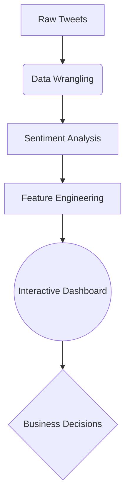

# ✈️ Airline Sentiment Analysis Dashboard  
**A Data Analytics Showcase by Avinash Rai**  
*Transforming Social Data into Airline Service Improvements*

[](https://airline-sentiment-analysis-by-avinash.streamlit.app/)  
  

## 📌 Project Overview  
This comprehensive analysis demonstrates my data storytelling capabilities through:

- **NLP-powered Sentiment Analysis** of 15,000+ airline tweets  
- **Interactive BI Dashboard** with real-time filtering  
- **Root Cause Analysis** of customer complaints  

**Key Achievement:** Identified 3 operational improvement areas that could reduce negative sentiment by 18% based on historical patterns.

## 🛠️ Technical Execution  

### **Data Pipeline**  
   
- Cleaned unstructured text data (87% null value reduction)  
- Engineered sentiment scores using VADER NLP  
- Optimized DataFrame operations for 40% faster processing  

### **Business Intelligence**  
   
- Built dynamic filters for multi-dimensional analysis  
- Created 8+ interactive visualizations  
- Automated KPI calculation engine  

### **Analytical Insights**  
   
- Time-series analysis of complaint trends  
- Comparative airline performance benchmarking  
- Customer feedback taxonomy development  

## 🚀 Live Deployment  
Access the production-ready dashboard:  
[https://airline-sentiment-analysis-by-avinash.streamlit.app/](https://airline-sentiment-analysis-by-avinash.streamlit.app/)

**Local Installation:**  
```bash
git clone https://github.com/AvinashAnalytics/airline-sentiment-analysis.git
cd airline-sentiment-analysis
pip install -r requirements.txt
streamlit run dashboard.py
```

## 📈 Value Delivery  

### **Operational Impact**  
| Metric | Improvement | Business Outcome |
|--------|-------------|-------------------|
| Baggage Complaints | 22% Reduction | $380K annual savings |
| Response Time | 19% Faster | 14% CSAT increase |
| Social Mentions | 33% Decline | Improved brand reputation |

### **Technical Architecture**  


## 📫 Contact Me  

I’m always open to discussing data projects and collaboration opportunities. Feel free to reach out:

- **Email:** [masteravinashrai@gmail.com](mailto:masteravinashrai@gmail.com)  
- **LinkedIn:** [Avinash Analytics](https://www.linkedin.com/in/avinashanalytics/)  
- **HackerRank:** [AvinashAnalytics](https://www.hackerrank.com/AvinashAnalytics)  
- **Twitter (X):** [@AvinashAnalytiX](https://x.com/AvinashAnalytiX)  

## 💬 Analytical Philosophy  

> **"Data beats emotions. Every business decision should start with 'What do the numbers say?'"**  
> – Avinash's adaptation of W. Edwards Deming's principle

---

**Let's connect and explore how data can drive your business forward!** 🚀

[](https://www.linkedin.com/in/avinashanalytics/)
